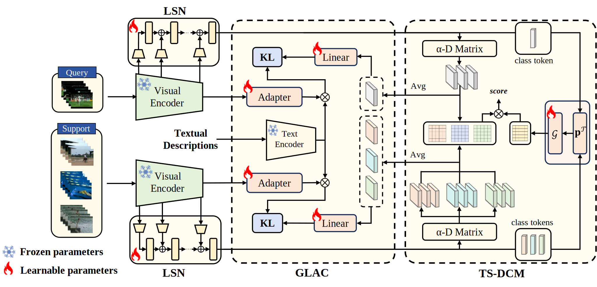

# TS-FSAR: Task-Specific Distance Correlation Matching for Few-Shot Action Recognition

<p align="center">
  
</p>

<p>
  <a href="#">
    
  </a>
  <a href="#">
    
  </a>
  <a href="https://github.com/yaozhang0417/TS-FSAR">
    
  </a>
</p>


> **Task-Specific Distance Correlation Matching for Few-Shot Action Recognition**
>
> <p>
> <em>
> Fei Long<sup>*1</sup>,
> Yao Zhang<sup>*1</sup>,
> Jiaming Lv<sup>1</sup>,
> Jiangtao Xie<sup>1</sup>,
> Peihua Li<sup>1&#8224;</sup>
> </em>
> </p>
>
> **Abstract:** Few-shot action recognition (FSAR) has recently made notable progress through set matching and efficient adaptation of large-scale pre-trained models. However, two key limitations persist. First, existing set matching metrics typically rely on cosine similarity to measure inter-frame linear dependencies and then perform matching with only instance-level information, thus failing to capture more complex patterns such as nonlinear relationships and overlooking task-specific cues. Second, for efficient adaptation of CLIP to FSAR, recent work performing fine-tuning via skip-fusion layers (which we refer to as side layers) has significantly reduced memory cost. However, the newly introduced side layers are often difficult to optimize under limited data conditions. To address these limitations, we propose TS-FSAR, a framework comprising three components: (1) a visual Ladder Side Network (LSN) for efficient CLIP fine-tuning; (2) a metric called Task-Specific Distance Correlation Matching (TS-DCM), which uses α-distance correlation to model both linear and nonlinear inter-frame dependencies and leverages a task prototype to enable task-specific matching; and (3) a Guiding LSN with Adapted CLIP (GLAC) module, which regularizes LSN using the adapted frozen CLIP to improve training for better α-distance correlation estimation under limited supervision. Extensive experiments on five widely used benchmarks demonstrate that our TS-FSAR yields superior performance compared to prior state-of-the-arts.

## Project Structure

> *Note: The <span style="color:#1e90ff;">model/</span> directory contains large pre-trained CLIP weights and is not included in this repository. You can download it from [here](https://drive.google.com/drive/folders/1oSdrD10AU1kwuyPdVTz5tN87QVNn2jod?usp=drive_link).*

```bash
TS-FSAR/
├── assets/             # Figures for README
├── configs/            # Configuration files for different datasets
├── datasets/           # Episodic sampling and data augmentation 
├── model/
│   └── vit-b-16/       # Pre-trained CLIP weights and config files (ViT-B/16)
├── prompts/            # LLM-generated class descriptions for different 
├── scripts/            # Shell scripts for training and testing
├── trainers/           # Core model architecture and method implementation
├── utils/              # Helper functions
├── main.py             # Entry point for training and evaluation 
├── requirements.txt    # Python dependencies
└── README.md           # Project documentation
```

## Implementations

### Environment Setup

> Hardware: Experiments were conducted using a single NVIDIA RTX 4090 GPU.  
> *Note: We strongly recommend aligning your hardware and software environment with ours to ensure reproducibility.*

Please create the same software environment as ours using the following commands:

```bash
conda create -n ts_fsar python=3.8
conda activate ts_fsar
pip install -r requirements.txt
```

### Data Preparation
>We support standard few-shot benchmarks including **SSv2-Full**, **SSv2-Small**, **Kinetics-100**, **HMDB51**, and **UCF101**.  
> ***Note:** We adopt the data preparation pipeline and split settings from [CLIP-FSAR](https://github.com/alibaba-mmai-research/CLIP-FSAR).
Please organize your datasets as follows:*

```bash
datapath/
├── smsm_full/
│   ├── 1.mp4
│   ├── 10.mp4
│   └── ...
├── smsm_small/
│   ├── 100001.mp4
│   └── ...
├── hmdb51/
│   └── videos/
│       ├── brush_hair/
│       │   ├── April_09_brush_hair_u_nm_np1_ba_goo_0.avi
│       │   └── ...
│       └── ... 
├── ucf101/
│   └── videos/
│       ├── ApplyEyeMakeup/
│       │   ├── v_ApplyEyeMakeup_g01_c01.avi
│       │   └── ...
│       └── ... 
├── kinetics100/
│   ├── air_drumming/
│   │   ├──-eGnPDG5Pxs_000053_000063.mp4.avi
│   │   └── ...
│   └── ... 
```

### Running

```bash
# Take SSv2_Full 1-shot as an example:
# Training
cd scripts/SSv2_Full/
sh metatrain_full_1shot.sh

# Testing
cd scripts/SSv2_Full/
sh metatest_full_1shot.sh
```

## Results

>This table reports the model’s classification performance on several standard video action recognition datasets. The best checkpoints for all datasets can be downloaded directly from [Here](https://drive.google.com/drive/folders/1qaZ7fGiuBgHUHNPPESj13VzHKqIMa1vw?usp=drive_link).

| Dataset | 5-way 1-shot | 5-way 5-shot |
| :--- | :---: | :---: |
| **SSv2-Full** | **75.1** | **83.5** |
| **SSv2-Small** | **60.5** | **70.3** |
| **HMDB51** | **85.0** | **88.9** |
| **UCF101** | **98.7** | **99.3** |
| **Kinetics** | **96.3** | **96.6** |

## Citation
If you find this work useful, please consider citing:

```Bibtex
@inproceedings{long2025taskspecific,
  title     = {Task-Specific Distance Correlation Matching for Few-Shot Action Recognition},
  author    = {Fei Long and Yao Zhang and Jiaming Lv and Jiangtao Xie and Peihua Li},
  booktitle = {The Fortieth AAAI Conference on Artificial Intelligence},
  year      = {2025}
}
```

## Acknowledgements

Our code is built upon [CLIP-FSAR](https://github.com/alibaba-mmai-research/CLIP-FSAR). We thank the authors for their open-source contribution. We also acknowledge the efforts of the [CLIP](https://github.com/openai/CLIP) team for providing the powerful pre-trained models.

## Contact
If you have any questions, please create an issue or contact Yao Zhang at zyemail@mail.dlut.edu.cn.